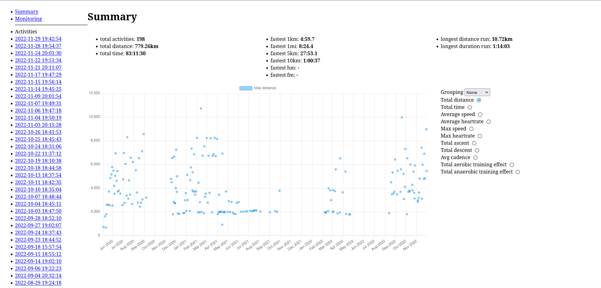
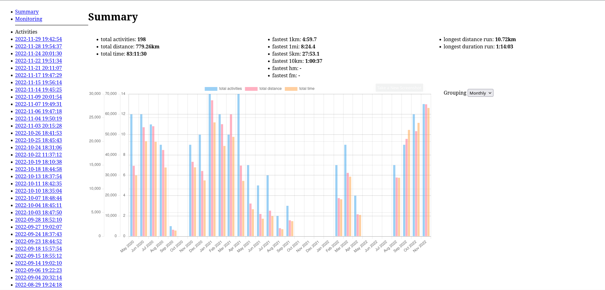
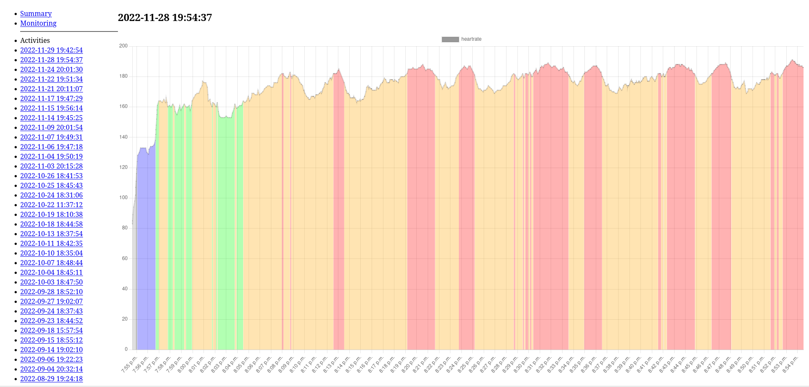
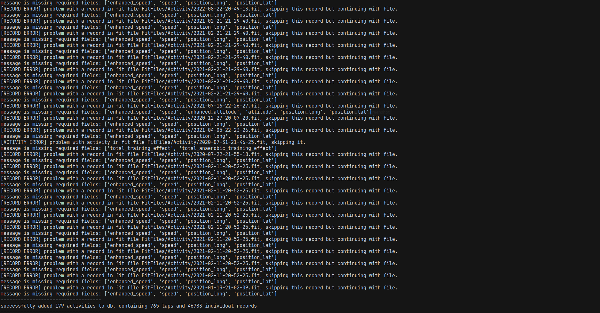

# FitFile Fitness Tracker Webapp
A hobby project to view running watch data locally in the browser. 
Includes a CLI for loading fitfiles into db and then running the local server.

Not intended for use by others - please use a fully featured alternative like https://github.com/tcgoetz/GarminDB

Languages/libraries:
- python
- python fitparse https://github.com/dtcooper/python-fitparse
- python flask https://flask.palletsprojects.com/en/2.2.x/
- sqlite3 
- html, css, vanilla js
- chartjs https://github.com/chartjs/Chart.js

# Screenshots
Summary view for all recorded activities

Group by week, month, year

View for each activity

CLI handles fitfile problems and adds valid entries to db

# Installation and Config
- python 3.8.10 used in development
- install fitparse via pip
- alternatively use a virtual python environment https://packaging.python.org/en/latest/guides/installing-using-pip-and-virtual-environments/
- run with `python app.py`

# To-Do
- package for distribution
- testing, test data
- finish summary view
- finish activity view
- smarten up with css
- convert units to more easily understood ones (eg. m/s to mins per km)
- add view for monitoring data
- add trendlines/predictions for data
- use gps location data to plot runs on map
    - several options for displaying gps data in general
        - https://github.com/gboeing/osmnx, needs docker installation and be careful not to query osm api too often
            - https://deepnote.com/@siew-sook-yan/Python-Retrieving-OpenStreetMap-data-with-OSMNX-34816147-fcc0-4509-b68d-8a9c72d3f986,
            example of getting other layers than just roads.
            - https://stackoverflow.com/questions/66084198/how-to-download-buildings-data-from-osm-with-a-polygon-shapefile-as-the-boundi,
            example of getting data within distance of point
            - https://stackoverflow.com/questions/60510290/how-to-save-graph-to-osm-format-with-osmnx-in-python,
            example of saving/loading osm data previously retrieved
            
        - https://github.com/marceloprates/prettymaps, simpler interface on top of osmnx
